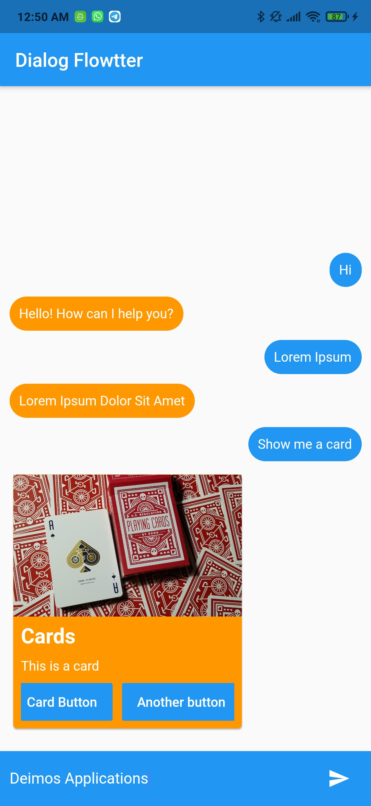

# Dialog Flowtter App Example

Basic showcase of the usage of the package _DialogFlowtter_

## Installing

- Clone this repository
- Run `flutter packages get`
- Add your `dialog_flow_auth.json` in the _example/assets/_ folder
- Run `flutter run` in the command line

## Run on web

Dialog Flowtter is fully suported for Flutter Web. To run in web follow the instructions:

- Run `flutter channel beta` in your terminal
- Run `flutter upgrade` to fetch the latest version of the Flutter SDK
- After the SDK is done upgrading, run `flutter config --enable-web` to get access to the web capability
- Run `flutter packages get` in the _example/_ folder
- Run `flutter run -d chrome` in the terminal

Enjoy Dialog Flowtter on the web!
